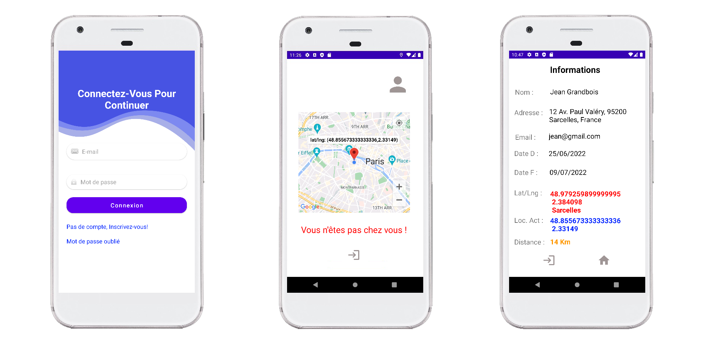

# :house: :mask: Quarantine Tracker :round_pushpin:

## A Propos
Application de quaratine tracker utilisant Kotlin pour Android. Ce projet porte sur la création d'une application tracker Android à l'aide de Kotlin. Pour obtenir la position actuelle, nous avons utilisé l'API Google Cloud. Des informations telles que la nom d'utilisateur, l'adresse, e-mail etc sont transmises à partir de Firebase que nous avons enregistré les cordonnées sur la page d'inscription.

Tout d'abord, vous devez vous inscrire avant de vous connecter à l'application. Ensuite, dans votre compte personnel, vos informations personnelles, votre emplacement et la distance entre votre adresse saisie et votre adresse actuelle sont affichés. Si vous êtes en dehors de la distance souhaitée, vous recevrez une notification sur votre téléphone.

      

## Exigences

* Android studio last version
* JDK 11
* Android SDK 31
* Supports API Level +21
* Material Components 1.5.0-alpha04
* Vous devez configurer Firebase dans votre propre compte
* Taille de la machine virtuelle : 1440 x 3040 ou 1080 x 2160

	
## Dépendances externes

Voici les API/services externes utilisés pour cette application :
* Google Cloud `(https://console.cloud.google.com/)`L'API principale utilisée pour les données de localisation actuelles.
* Firebase `( https://firebase.google.com/ )` Un service de session privée est fourni aux utilisateurs.
